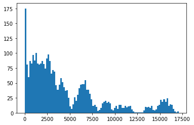
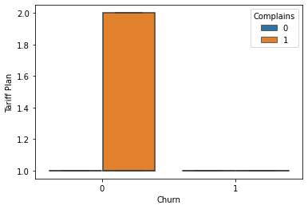
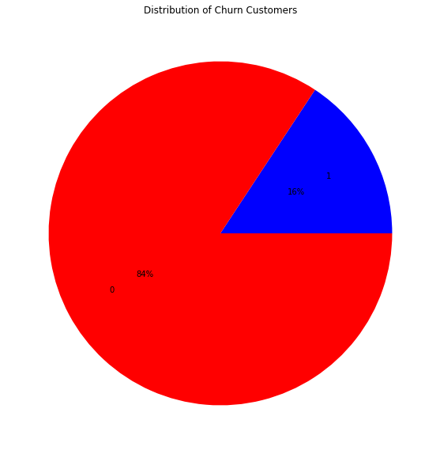
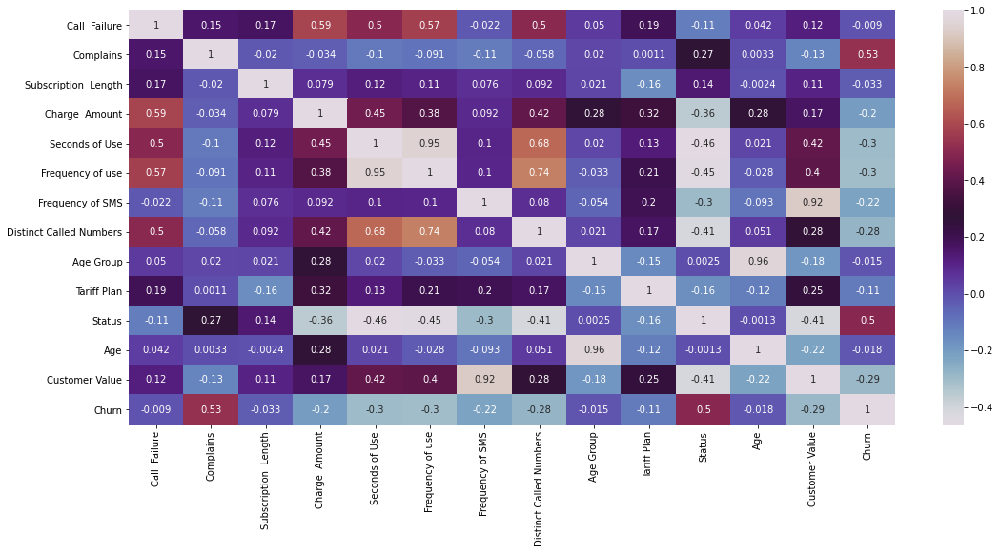
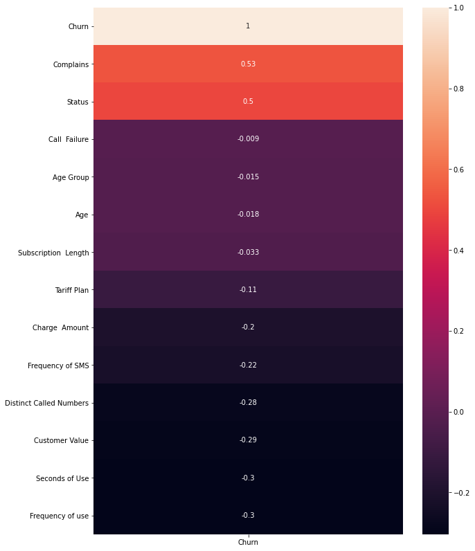

```python
import pandas as pd
#Loading the case1churn.csv dataset
datainput = pd.read_csv('Case1Churn.csv')
datainput.head()
```


<div>
<style scoped>
    .dataframe tbody tr th:only-of-type {
        vertical-align: middle;
    }

    .dataframe tbody tr th {
        vertical-align: top;
    }

    .dataframe thead th {
        text-align: right;
    }
</style>
<table border="1" class="dataframe">
  <thead>
    <tr style="text-align: right;">
      <th></th>
      <th>Call  Failure</th>
      <th>Complains</th>
      <th>Subscription  Length</th>
      <th>Charge  Amount</th>
      <th>Seconds of Use</th>
      <th>Frequency of use</th>
      <th>Frequency of SMS</th>
      <th>Distinct Called Numbers</th>
      <th>Age Group</th>
      <th>Tariff Plan</th>
      <th>Status</th>
      <th>Age</th>
      <th>Customer Value</th>
      <th>FN</th>
      <th>FP</th>
      <th>Churn</th>
    </tr>
  </thead>
  <tbody>
    <tr>
      <th>0</th>
      <td>8</td>
      <td>0</td>
      <td>38</td>
      <td>0</td>
      <td>4370</td>
      <td>71</td>
      <td>5</td>
      <td>17</td>
      <td>3</td>
      <td>1</td>
      <td>1</td>
      <td>30</td>
      <td>197.640</td>
      <td>177.8760</td>
      <td>69.7640</td>
      <td>0</td>
    </tr>
    <tr>
      <th>1</th>
      <td>0</td>
      <td>0</td>
      <td>39</td>
      <td>0</td>
      <td>318</td>
      <td>5</td>
      <td>7</td>
      <td>4</td>
      <td>2</td>
      <td>1</td>
      <td>2</td>
      <td>25</td>
      <td>46.035</td>
      <td>41.4315</td>
      <td>60.0000</td>
      <td>0</td>
    </tr>
    <tr>
      <th>2</th>
      <td>10</td>
      <td>0</td>
      <td>37</td>
      <td>0</td>
      <td>2453</td>
      <td>60</td>
      <td>359</td>
      <td>24</td>
      <td>3</td>
      <td>1</td>
      <td>1</td>
      <td>30</td>
      <td>1536.520</td>
      <td>1382.8680</td>
      <td>203.6520</td>
      <td>0</td>
    </tr>
    <tr>
      <th>3</th>
      <td>10</td>
      <td>0</td>
      <td>38</td>
      <td>0</td>
      <td>4198</td>
      <td>66</td>
      <td>1</td>
      <td>35</td>
      <td>1</td>
      <td>1</td>
      <td>1</td>
      <td>15</td>
      <td>240.020</td>
      <td>216.0180</td>
      <td>74.0020</td>
      <td>0</td>
    </tr>
    <tr>
      <th>4</th>
      <td>3</td>
      <td>0</td>
      <td>38</td>
      <td>0</td>
      <td>2393</td>
      <td>58</td>
      <td>2</td>
      <td>33</td>
      <td>1</td>
      <td>1</td>
      <td>1</td>
      <td>15</td>
      <td>145.805</td>
      <td>131.2245</td>
      <td>64.5805</td>
      <td>0</td>
    </tr>
  </tbody>
</table>
</div>


```python
#checking total values of the case1churn.csv dataset
datainput['Churn'].value_counts()
```


    0    2655
    1     495
    Name: Churn, dtype: int64


```python
#Exploring dataset/checking customer churn by age
print(datainput.groupby('Age')['Churn'].value_counts())
```

    Age  Churn
    15   0         123
    25   0         853
         1         184
    30   0        1195
         1         230
    45   0         316
         1          79
    55   0         168
         1           2
    Name: Churn, dtype: int64
    


```python
# Import matplotlib and seaborn
import matplotlib.pyplot as plt
import seaborn as sns
  
# Visualize the distribution of 'Total day minutes'
plt.hist(datainput['Seconds of Use'], bins = 100)
  
# Display the plot
plt.show()
```


    

    


```python
# Creating a box plot to understand the binary variables
sns.boxplot(x = 'Churn',
            y = 'Tariff Plan',
            data = datainput,
            sym = "",                  
            hue = "Complains") 
# Display the plot
plt.show()
```


    

    


```python
# Displaying information about the dataset
datainput.info()
```

    <class 'pandas.core.frame.DataFrame'>
    RangeIndex: 3150 entries, 0 to 3149
    Data columns (total 16 columns):
     #   Column                   Non-Null Count  Dtype  
    ---  ------                   --------------  -----  
     0   Call  Failure            3150 non-null   int64  
     1   Complains                3150 non-null   int64  
     2   Subscription  Length     3150 non-null   int64  
     3   Charge  Amount           3150 non-null   int64  
     4   Seconds of Use           3150 non-null   int64  
     5   Frequency of use         3150 non-null   int64  
     6   Frequency of SMS         3150 non-null   int64  
     7   Distinct Called Numbers  3150 non-null   int64  
     8   Age Group                3150 non-null   int64  
     9   Tariff Plan              3150 non-null   int64  
     10  Status                   3150 non-null   int64  
     11  Age                      3150 non-null   int64  
     12  Customer Value           3150 non-null   float64
     13  FN                       3150 non-null   float64
     14  FP                       3150 non-null   float64
     15  Churn                    3150 non-null   int64  
    dtypes: float64(3), int64(13)
    memory usage: 393.9 KB
    


```python
# Diplaying summary of the dataset
datainput.describe()
```


<div>
<style scoped>
    .dataframe tbody tr th:only-of-type {
        vertical-align: middle;
    }

    .dataframe tbody tr th {
        vertical-align: top;
    }

    .dataframe thead th {
        text-align: right;
    }
</style>
<table border="1" class="dataframe">
  <thead>
    <tr style="text-align: right;">
      <th></th>
      <th>Call  Failure</th>
      <th>Complains</th>
      <th>Subscription  Length</th>
      <th>Charge  Amount</th>
      <th>Seconds of Use</th>
      <th>Frequency of use</th>
      <th>Frequency of SMS</th>
      <th>Distinct Called Numbers</th>
      <th>Age Group</th>
      <th>Tariff Plan</th>
      <th>Status</th>
      <th>Age</th>
      <th>Customer Value</th>
      <th>FN</th>
      <th>FP</th>
      <th>Churn</th>
    </tr>
  </thead>
  <tbody>
    <tr>
      <th>count</th>
      <td>3150.000000</td>
      <td>3150.000000</td>
      <td>3150.000000</td>
      <td>3150.000000</td>
      <td>3150.000000</td>
      <td>3150.000000</td>
      <td>3150.000000</td>
      <td>3150.000000</td>
      <td>3150.000000</td>
      <td>3150.000000</td>
      <td>3150.000000</td>
      <td>3150.000000</td>
      <td>3150.000000</td>
      <td>3150.000000</td>
      <td>3150.000000</td>
      <td>3150.000000</td>
    </tr>
    <tr>
      <th>mean</th>
      <td>7.627937</td>
      <td>0.076508</td>
      <td>32.541905</td>
      <td>0.942857</td>
      <td>4472.459683</td>
      <td>69.460635</td>
      <td>73.174921</td>
      <td>23.509841</td>
      <td>2.826032</td>
      <td>1.077778</td>
      <td>1.248254</td>
      <td>30.998413</td>
      <td>470.972916</td>
      <td>423.875624</td>
      <td>98.304688</td>
      <td>0.157143</td>
    </tr>
    <tr>
      <th>std</th>
      <td>7.263886</td>
      <td>0.265851</td>
      <td>8.573482</td>
      <td>1.521072</td>
      <td>4197.908687</td>
      <td>57.413308</td>
      <td>112.237560</td>
      <td>17.217337</td>
      <td>0.892555</td>
      <td>0.267864</td>
      <td>0.432069</td>
      <td>8.831095</td>
      <td>517.015433</td>
      <td>465.313890</td>
      <td>50.724492</td>
      <td>0.363993</td>
    </tr>
    <tr>
      <th>min</th>
      <td>0.000000</td>
      <td>0.000000</td>
      <td>3.000000</td>
      <td>0.000000</td>
      <td>0.000000</td>
      <td>0.000000</td>
      <td>0.000000</td>
      <td>0.000000</td>
      <td>1.000000</td>
      <td>1.000000</td>
      <td>1.000000</td>
      <td>15.000000</td>
      <td>0.000000</td>
      <td>0.000000</td>
      <td>60.000000</td>
      <td>0.000000</td>
    </tr>
    <tr>
      <th>25%</th>
      <td>1.000000</td>
      <td>0.000000</td>
      <td>30.000000</td>
      <td>0.000000</td>
      <td>1391.250000</td>
      <td>27.000000</td>
      <td>6.000000</td>
      <td>10.000000</td>
      <td>2.000000</td>
      <td>1.000000</td>
      <td>1.000000</td>
      <td>25.000000</td>
      <td>113.801250</td>
      <td>102.421125</td>
      <td>61.380125</td>
      <td>0.000000</td>
    </tr>
    <tr>
      <th>50%</th>
      <td>6.000000</td>
      <td>0.000000</td>
      <td>35.000000</td>
      <td>0.000000</td>
      <td>2990.000000</td>
      <td>54.000000</td>
      <td>21.000000</td>
      <td>21.000000</td>
      <td>3.000000</td>
      <td>1.000000</td>
      <td>1.000000</td>
      <td>30.000000</td>
      <td>228.480000</td>
      <td>205.632000</td>
      <td>72.848000</td>
      <td>0.000000</td>
    </tr>
    <tr>
      <th>75%</th>
      <td>12.000000</td>
      <td>0.000000</td>
      <td>38.000000</td>
      <td>1.000000</td>
      <td>6478.250000</td>
      <td>95.000000</td>
      <td>87.000000</td>
      <td>34.000000</td>
      <td>3.000000</td>
      <td>1.000000</td>
      <td>1.000000</td>
      <td>30.000000</td>
      <td>788.388750</td>
      <td>709.549875</td>
      <td>128.838875</td>
      <td>0.000000</td>
    </tr>
    <tr>
      <th>max</th>
      <td>36.000000</td>
      <td>1.000000</td>
      <td>47.000000</td>
      <td>10.000000</td>
      <td>17090.000000</td>
      <td>255.000000</td>
      <td>522.000000</td>
      <td>97.000000</td>
      <td>5.000000</td>
      <td>2.000000</td>
      <td>2.000000</td>
      <td>55.000000</td>
      <td>2165.280000</td>
      <td>1948.752000</td>
      <td>266.528000</td>
      <td>1.000000</td>
    </tr>
  </tbody>
</table>
</div>


```python
# Preprocessing the dataset/dropping unwanted variables

datainput.drop(['FN','FP'], axis=1, inplace=True)
datainput
```


<div>
<style scoped>
    .dataframe tbody tr th:only-of-type {
        vertical-align: middle;
    }

    .dataframe tbody tr th {
        vertical-align: top;
    }

    .dataframe thead th {
        text-align: right;
    }
</style>
<table border="1" class="dataframe">
  <thead>
    <tr style="text-align: right;">
      <th></th>
      <th>Call  Failure</th>
      <th>Complains</th>
      <th>Subscription  Length</th>
      <th>Charge  Amount</th>
      <th>Seconds of Use</th>
      <th>Frequency of use</th>
      <th>Frequency of SMS</th>
      <th>Distinct Called Numbers</th>
      <th>Age Group</th>
      <th>Tariff Plan</th>
      <th>Status</th>
      <th>Age</th>
      <th>Customer Value</th>
      <th>Churn</th>
    </tr>
  </thead>
  <tbody>
    <tr>
      <th>0</th>
      <td>8</td>
      <td>0</td>
      <td>38</td>
      <td>0</td>
      <td>4370</td>
      <td>71</td>
      <td>5</td>
      <td>17</td>
      <td>3</td>
      <td>1</td>
      <td>1</td>
      <td>30</td>
      <td>197.640</td>
      <td>0</td>
    </tr>
    <tr>
      <th>1</th>
      <td>0</td>
      <td>0</td>
      <td>39</td>
      <td>0</td>
      <td>318</td>
      <td>5</td>
      <td>7</td>
      <td>4</td>
      <td>2</td>
      <td>1</td>
      <td>2</td>
      <td>25</td>
      <td>46.035</td>
      <td>0</td>
    </tr>
    <tr>
      <th>2</th>
      <td>10</td>
      <td>0</td>
      <td>37</td>
      <td>0</td>
      <td>2453</td>
      <td>60</td>
      <td>359</td>
      <td>24</td>
      <td>3</td>
      <td>1</td>
      <td>1</td>
      <td>30</td>
      <td>1536.520</td>
      <td>0</td>
    </tr>
    <tr>
      <th>3</th>
      <td>10</td>
      <td>0</td>
      <td>38</td>
      <td>0</td>
      <td>4198</td>
      <td>66</td>
      <td>1</td>
      <td>35</td>
      <td>1</td>
      <td>1</td>
      <td>1</td>
      <td>15</td>
      <td>240.020</td>
      <td>0</td>
    </tr>
    <tr>
      <th>4</th>
      <td>3</td>
      <td>0</td>
      <td>38</td>
      <td>0</td>
      <td>2393</td>
      <td>58</td>
      <td>2</td>
      <td>33</td>
      <td>1</td>
      <td>1</td>
      <td>1</td>
      <td>15</td>
      <td>145.805</td>
      <td>0</td>
    </tr>
    <tr>
      <th>...</th>
      <td>...</td>
      <td>...</td>
      <td>...</td>
      <td>...</td>
      <td>...</td>
      <td>...</td>
      <td>...</td>
      <td>...</td>
      <td>...</td>
      <td>...</td>
      <td>...</td>
      <td>...</td>
      <td>...</td>
      <td>...</td>
    </tr>
    <tr>
      <th>3145</th>
      <td>21</td>
      <td>0</td>
      <td>19</td>
      <td>2</td>
      <td>6697</td>
      <td>147</td>
      <td>92</td>
      <td>44</td>
      <td>2</td>
      <td>2</td>
      <td>1</td>
      <td>25</td>
      <td>721.980</td>
      <td>0</td>
    </tr>
    <tr>
      <th>3146</th>
      <td>17</td>
      <td>0</td>
      <td>17</td>
      <td>1</td>
      <td>9237</td>
      <td>177</td>
      <td>80</td>
      <td>42</td>
      <td>5</td>
      <td>1</td>
      <td>1</td>
      <td>55</td>
      <td>261.210</td>
      <td>0</td>
    </tr>
    <tr>
      <th>3147</th>
      <td>13</td>
      <td>0</td>
      <td>18</td>
      <td>4</td>
      <td>3157</td>
      <td>51</td>
      <td>38</td>
      <td>21</td>
      <td>3</td>
      <td>1</td>
      <td>1</td>
      <td>30</td>
      <td>280.320</td>
      <td>0</td>
    </tr>
    <tr>
      <th>3148</th>
      <td>7</td>
      <td>0</td>
      <td>11</td>
      <td>2</td>
      <td>4695</td>
      <td>46</td>
      <td>222</td>
      <td>12</td>
      <td>3</td>
      <td>1</td>
      <td>1</td>
      <td>30</td>
      <td>1077.640</td>
      <td>0</td>
    </tr>
    <tr>
      <th>3149</th>
      <td>8</td>
      <td>1</td>
      <td>11</td>
      <td>2</td>
      <td>1792</td>
      <td>25</td>
      <td>7</td>
      <td>9</td>
      <td>3</td>
      <td>1</td>
      <td>1</td>
      <td>30</td>
      <td>100.680</td>
      <td>1</td>
    </tr>
  </tbody>
</table>
<p>3150 rows × 14 columns</p>
</div>


```python
# Visualizing summary of churn in the dataset

plt.figure(figsize=(10,10))
plt.pie(x=[495, 2655], labels=['1','0'], autopct='%1.0f%%', pctdistance=0.5,labeldistance=0.7,colors=['b','r'])
plt.title('Distribution of Churn Customers')
```


    Text(0.5, 1.0, 'Distribution of Churn Customers')


    

    


```python
# Creating a correlation matrix plot
corr = datainput.corr()
plt.figure(figsize=(18,8))
sns.heatmap(corr, annot = True, cmap='twilight')
```


    <AxesSubplot:>


    

    


```python
# Creating a correlation matrix plot in order

fig, ax = plt.subplots(figsize=(10,14))
churn_data_corr = datainput.corr()[['Churn']].sort_values(
  by='Churn', ascending=False)
sns.heatmap(churn_data_corr, annot=True, ax=ax)
```


    <AxesSubplot:>


    

    


```python
#Identifying response variable:
    
response = datainput['Churn']
dataset = datainput.drop(columns = 'Churn')
```


```python
# Creating a training and testing data 

from sklearn.model_selection import train_test_split
X_train, X_test, y_train, y_test = train_test_split(datainput, response,stratify = response, test_size = 0.2)
```


```python
print("Number transactions X_train datainput: ", X_train.shape)
print("Number transactions y_train datainput: ", y_train.shape)
print("Number transactions X_test datainput: ", X_test.shape)
print("Number transactions y_test datainput: ", y_test.shape)
```

    Number transactions X_train datainput:  (2520, 14)
    Number transactions y_train datainput:  (2520,)
    Number transactions X_test datainput:  (630, 14)
    Number transactions y_test datainput:  (630,)
    


```python
# Creating Support Vector Machine and Predicting 

from sklearn.svm import SVC
svclassifier = SVC(kernel='linear', probability= True)
svclassifier.fit(X_train, y_train)

y_pred = svclassifier.predict(X_test)

```


    SVC(kernel='linear', probability=True)


```python
# Creating Evaluation Metrics of the Support Vector Machine 
from sklearn.metrics import classification_report, confusion_matrix
print(confusion_matrix(y_test, y_pred))
print(classification_report(y_test, y_pred))

```


```python

```
